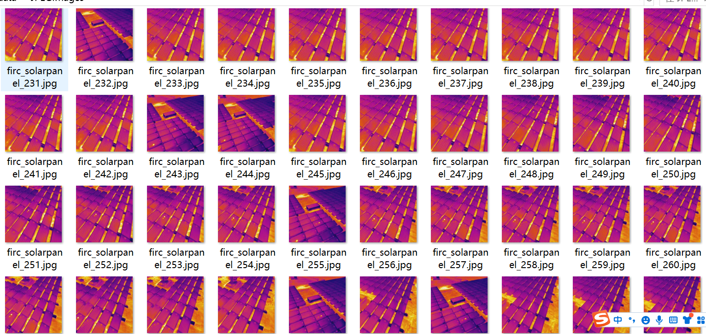
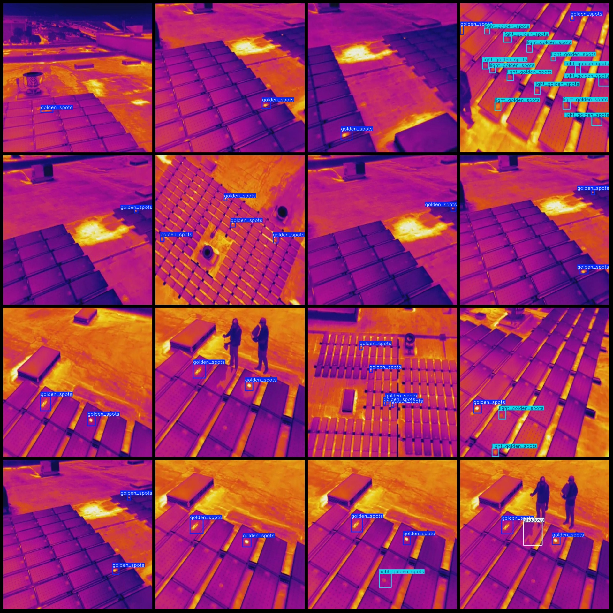
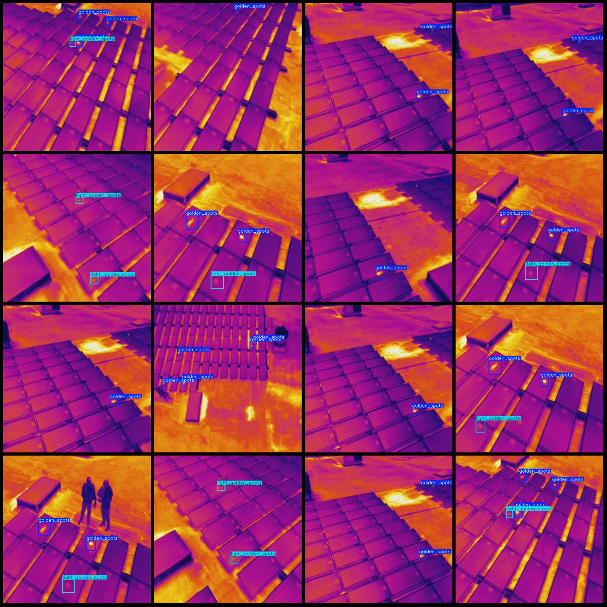

# Drone Viewpoint Infrared Image Solar PV Panel Hotspot Shadow Defect Detection Dataset VOC+YOLO Format: 667 Images in 3 Classes

Dataset format: Pascal VOC format + YOLO format (txt file without split path, only containing jpg images and corresponding VOC format xml files and yolo format txt files)

Number of images (jpg file count): 667
Number of annotations (xml file count): 667
Number of annotations (txt file count): 667
Number of annotation categories: 3
Annotation category names (note that the order of categories in the yolo format does not match this, but is based on the labels folder classes.txt): ["golden_spots", "light_golden_spots", "shadows"]

Number of bounding boxes for each category:
- golden_spots (Golden spots) bounding box count = 1416
- light_golden_spots (Light golden spots) bounding box count = 463
- shadows (Shadows) bounding box count = 47
Total bounding box count: 1926

Image resolution: 640x640
Drone: DJI MAVIC 3
Collection height: 15-20m
Collection angle: 80-90°
Annotation tool used: labelImg
Annotation rule: draw rectangle bounding boxes for categories

Important notes: None
Special statement: This dataset does not guarantee the accuracy of the trained model or weight files

Image preview:

## Images

Here is a pay link on Stripe ( https://buy.stripe.com/3cs8yP7sY87d0vu9AB ). Please contact me lonlonago@foxmail.com after funding $89, and I will send you a complete data files , thank you!

